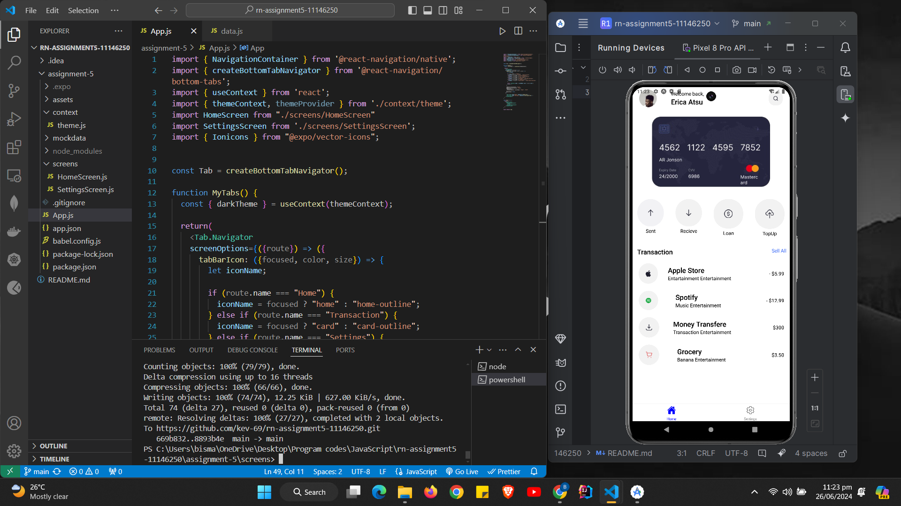
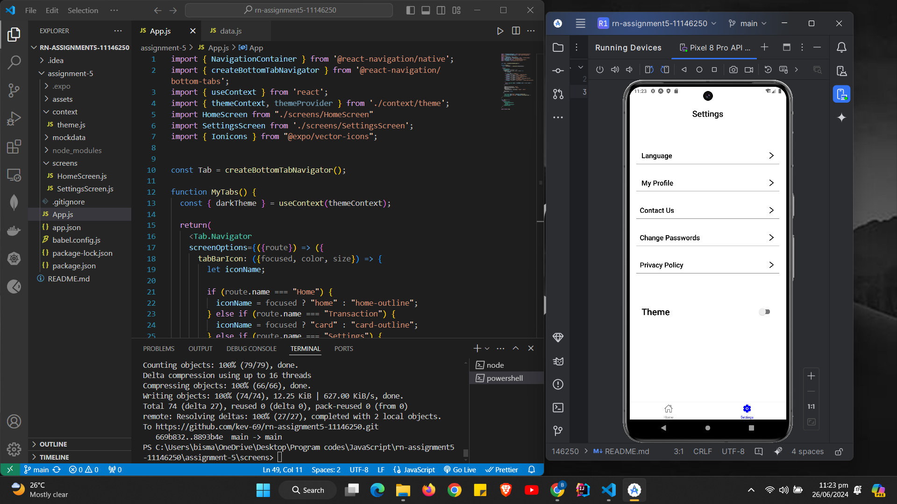

# rn-assignment5-11146250
DCIT202 MOBILE APPLICATION DEVELOPMENT Assignment 5

# Description
I created a git repo with the necessary name
I cloned it to my local computer
Used npx create-expo-app to create the project
Then I downloaded all the photos and icons from the google drive
I then placed them in the assets folder
Also I created a file for the context API
And a file for a mock data
Created seperated screens for home and settings page
I then used npx expo start to text my application

# Screenshots
Home Light Theme

Home Dark Theme

Settings Light Theme

Settings Dark Theme
